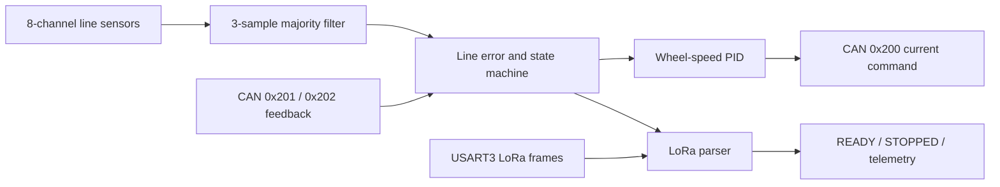

# STM32 CAN Line-Following Car

基于 STM32F103 的差速循迹车固件。主工程读取八路循迹传感器，以 CAN 闭环控制两台 DJI M2006 电机，并使用 USART3 连接 DX-LR03 LoRa 模块发送状态与诊断遥测。

> 本文档描述当前源码与工程配置。构建通过、烧录成功、CAN/LoRa 通信和实际循迹均属于不同的验收层级，不能互相替代。

## 工程单元

| 路径 | 作用 |
| --- | --- |
| `Sanmotai0917/` | 主循迹车固件：CubeMX 配置、Keil 工程、应用代码和 BSP。 |
| `Sanmotai0917/Core/` | CubeMX 生成的入口、外设初始化与中断；循迹和 LoRa 业务逻辑位于 `Core/Src/main.c`。 |
| `Sanmotai0917/bsp/` | CAN 帧收发、M2006 反馈缓存和通用 PID 实现。 |
| `Sanmotai0917/Drivers/` | STM32F1 HAL、CMSIS 和第三方依赖。 |
| `Sanmotai0917/MDK-ARM/pid2308v1.uvprojx` | 主 Keil MDK-ARM 工程，目标为 `pid2308v1`。 |
| `Sanmotai0917/PWM_Fixed_Test/` | 独立 TIM3 CH2 固定占空比 PWM 验证工程。 |

根目录还保留了硬件参考资料和图片资源。`MDK-ARM/pid2308v1/`、`PWM_Fixed_Test/Objects/` 及 `Listings/` 是本地构建输出目录，已由 `.gitignore` 排除。

## 主控制架构

`main()` 初始化 HAL、时钟、GPIO、CAN、USART1/2/3 与 TIM3，随后配置 CAN 过滤器、将电机电流置零、启用 USART3 单字节中断并启动 LoRa READY 定时。主循环每 10 ms 读取传感器并执行 `LineFollow_Control()`；`LoraProtocol_Task()` 在每一轮循环中处理 READY、运行遥测和 STOPPED 发送。

### 循迹与安全状态

`LineFollow_Control()` 使用以下状态，任何 CAN 发送失败或关键反馈超时都会进入 `FAULT` 并下发零电流：

1. `WAIT_FEEDBACK`：保持电机零电流，等待 `0x201` 与 `0x202` 的新鲜 CAN 反馈。
2. `WAIT_LORA_READY`：电机仍保持零电流，等待固定 READY 帧发送完成。
3. `START_DELAY`：从 READY 帧发送完成时刻起等待 `LINE_FOLLOW_START_DELAY_MS`（当前 7.5 s）。
4. `WAIT_LINE`：要求连续 `LINE_FOLLOW_START_VALID_SAMPLES`（当前 3）个有效线位采样后才起步。
5. `RUN`：按线误差输出差速转速；运行超时或反馈失效进入 `FAULT`。
6. `SEARCH`：丢线时先短暂保持上一次命令，之后按最后有效偏差方向低速搜索；重新检测到线后返回 `RUN`。
7. `STOP_A`：平均里程达到 A 点解锁距离后，先由右侧传感器触发、再由左侧确认；下发零速并等待停稳或制动超时。
8. `DONE` / `FAULT`：持续发送零电流。`DONE` 状态会发送有限次数的 LoRa STOPPED 帧。

八路原始输入经三采样多数滤波。`LineFollow_ComputeError()` 对相邻的有效传感器段加权求偏差，并选择最接近上一偏差的段；`LineFollow_LimitErrorJump()` 再限制突变，避免多线或噪声导致的跳转。

### 电机 CAN 链路

| 项目 | 当前实现 |
| --- | --- |
| CAN1 引脚 | PA11 RX、PA12 TX |
| CAN 配置 | `.ioc` 配置为约 1 Mbit/s，接收使用 FIFO1 中断。 |
| 下发帧 | 标准帧 `0x200`，8 字节，四个 16 位电流命令。循迹控制只使用前两个通道。 |
| 反馈帧 | `0x201`、`0x202`；前四字节被解析为角度与转速，并附带有效标志和时间戳。 |
| 反馈保护 | 两台电机都必须有新鲜反馈；阈值为 `LINE_FOLLOW_FEEDBACK_TIMEOUT_MS`，当前 100 ms。 |

线误差先转换为目标轮端转速，再乘以 M2006 减速比 36 作为速度 PID 目标。当前速度 PID 的 `KP/KI/KD` 分别为 `0.4/0.03/0.0`，输出限幅为 4500；这些值是控制内部参数，不是物理车速单位。

### 循迹调参入口

所有主循迹常量集中在 `Sanmotai0917/Core/Src/main.c`：

| 参数组 | 关键宏 | 当前作用 |
| --- | --- | --- |
| 基础速度与弯道减速 | `LINE_FOLLOW_BASE_OUTPUT_RPM`、`LINE_FOLLOW_CURVE_MIN_OUTPUT_RPM`、`LINE_FOLLOW_CURVE_SLOWDOWN_RPM_PER_ERROR` | 直线基速当前为 39 rpm；误差增大时降低基础速度。 |
| 转向 | `LINE_FOLLOW_KP_NEAR_RPM_PER_ERROR`、`LINE_FOLLOW_KP_FAR_RPM_PER_ERROR`、`LINE_FOLLOW_KD_RPM_PER_ERROR_DELTA` | 近线/弯道分别使用 2.4/3.8 的比例系数；微分项用于抑制偏差变化。 |
| 平滑与限幅 | `LINE_FOLLOW_TURN_SLEW_*`、`LINE_FOLLOW_MAX_D_TURN_RPM`、`LINE_FOLLOW_MAX_TURN_RPM` | 限制转向建立、释放与总差速，减少过冲。 |
| 丢线 | `LINE_FOLLOW_LOST_HOLD_TIME_MS`、`LINE_FOLLOW_LOST_OUTPUT_RPM`、`LINE_FOLLOW_LOST_TURN_RPM` | 短暂保持上次命令，之后向最后有效偏差方向搜索。 |
| A 点停车 | `LINE_FOLLOW_A_MARKER_*`、`LINE_FOLLOW_STOP_*` | 基于编码器里程和左右传感器顺序确认终点，并等待实际转速低于阈值。 |

`line_error=0` 表示检测到居中的线；`LineFollow_ComputeError()` 返回零个有效传感器才表示丢线。调参前应先确认传感器安装方向、原始电平和线位映射。

## LoRa 协议与遥测

LoRa 使用 USART3（PB10 TX、PB11 RX，115200 bit/s，8N1）。PA5 是模块 M1 控制脚，PA6 是 AUX 输入。当前 `LORA_USE_AUX=0`，因此 AUX 未接线时 PA6 使用下拉输入，发送不依赖 AUX 状态。

控制帧为 6 字节：`AA 55 SRC CMD RID SUM`，其中 `SUM` 是字节 2–4 的模 256 累加和。

| 命令 | 方向 | 行为 |
| --- | --- | --- |
| `READY` (`0x01`) | 车 → 地面端 | 上电稳定 500 ms 后发送固定帧 `AA 55 01 01 3A 3C`。 |
| `START` (`0x02`) | 地面端 → 车 | 解析器校验来源、运行 ID 与校验和后置位 `start_received`。 |
| `STOPPED` (`0x03`) | 车 → 地面端 | 到达 `DONE` 后按 100 ms 间隔发送 3 次。 |
| `TELEMETRY` (`0x20`) | 车 → 地面端 | `RUN` 或 `SEARCH` 时每 100 ms 发送 21 字节诊断帧。 |

遥测帧依次携带运行 ID、序号、状态、原始/滤波传感器掩码、带符号线误差、转向量、左右目标转速和左右实测转速；16 位速度与转向量为小端格式并以 0.1 rpm 缩放。

### 当前协议限制

- `START` 帧目前只设置 `start_received`/`start_ack_pending` 标志；主循迹状态机不以该标志作为起跑门控，车辆仍由 READY 后的延迟与有效黑线条件进入 `RUN`。
- `LORA_COMMAND_START_ACK` 已定义，但当前 `LoraProtocol_Task()` 没有对应的发送调用。因此不能把 START_ACK 视为已实现的空口确认。

## 引脚与外设

| 功能 | 引脚 | 说明 |
| --- | --- | --- |
| CAN1 | PA11 / PA12 | 电机总线接收 / 发送。 |
| LoRa USART3 | PB10 / PB11 | 模块串口发送 / 接收。 |
| LoRa M1 / AUX | PA5 / PA6 | M1 输出；AUX 输入。 |
| 右侧循迹 | PB6–PB9 | D01–D04，上拉输入。 |
| 左侧循迹 | PB15–PB12 | D01–D04，上拉输入。 |
| PWM | PA7 / TIM3_CH2 | 主工程外设配置与独立 PWM 测试工程均使用该通道。 |
| 调试 | PA13 / PA14 | SWDIO / SWCLK。 |

USART1（PA9/PA10，9600 bit/s）和 USART2（PA2/PA3，115200 bit/s）仍会初始化，但当前主循环中对应的接收启动代码位于 `#if 0` 块，不属于主循迹路径。

## 构建与辅助工程

主工程由 `Sanmotai0917/pid2308v1.ioc` 生成，配置的工具链是 **Keil MDK-ARM V5.32**、STM32Cube FW F1 V1.8.4。打开 `Sanmotai0917/MDK-ARM/pid2308v1.uvprojx`，构建目标 `pid2308v1`；项目配置已启用 HEX 输出。

`Sanmotai0917/PWM_Fixed_Test/PWM_Fixed_Test.uvprojx` 是独立测试工程。它将 TIM3 CH2 配置为约 50 Hz PWM，`PWM_DUTY_PERCENT` 的可调范围为 2.5%–12.5%，默认 7.5%。

仓库未发现项目级 CI 工作流、自动化测试目录或可复现的主工程构建脚本。本次文档更新未执行构建，以避免在含有未提交固件修改的工作区生成额外产物。

## 配置与维护边界

- CubeMX 配置标识 MCU 为 `STM32F103C8T6`，而 Keil 主工程设备字段为 `STM32F103T6`。重新生成代码、选择下载算法或烧录前必须按实际板卡确认该差异。
- `Sanmotai0917/MDK-ARM/jlink_flash.jlink` 仍引用旧的绝对路径 `D:\Huge_car\...`；仓库改名后不能直接作为当前目录的烧录脚本使用。
- 修改 CubeMX 生成文件时保留 `USER CODE` 区域，并复核 `HAL_Init()`、时钟配置和全部 `MX_*_Init()` 的初始化顺序。
- 根目录没有项目级 `LICENSE` 文件；HAL/CMSIS 与 BSP 文件中的第三方版权和许可声明仍然有效。

## 验收层次

| 层次 | 当前结论 |
| --- | --- |
| 源码与配置 | 已按当前工作区审查。 |
| 构建产物 | 本次未重新构建，未形成新的构建结论。 |
| 调试器识别与烧录 | 未在本次审查中执行。 |
| CAN / LoRa 通信 | 源码具备对应实现；未在本次审查中进行实物通信验证。 |
| 传感器与实际循迹 | 未在本次审查中进行实车验证。 |
