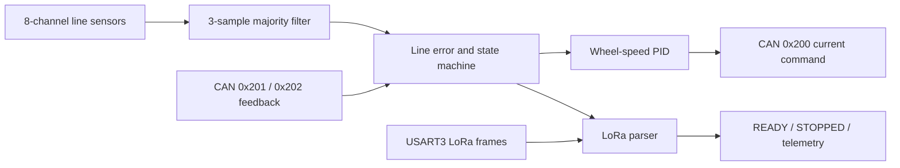

# STM32 CAN Line-Following Car

English | [中文](README.zh.md)

Differential-drive line-following firmware based on the STM32F103. The main project reads eight line sensors, controls two DJI M2006 motors through a closed-loop CAN interface, and uses USART3 with a DX-LR03 LoRa module for status and diagnostic telemetry.

> This document describes the current source code and project configuration. A successful build, successful flashing, CAN/LoRa communication, and physical line-following are separate acceptance levels and do not substitute for one another.

## Project units

| Path | Purpose |
| --- | --- |
| `Sanmotai0917/` | Main line-following firmware: CubeMX configuration, Keil project, application code, and BSP. |
| `Sanmotai0917/Core/` | CubeMX-generated entrypoint, peripheral initialization, and interrupts; line-following and LoRa application logic is in `Core/Src/main.c`. |
| `Sanmotai0917/bsp/` | CAN frame handling, M2006 feedback cache, and general-purpose PID implementation. |
| `Sanmotai0917/Drivers/` | STM32F1 HAL, CMSIS, and third-party dependencies. |
| `Sanmotai0917/MDK-ARM/pid2308v1.uvprojx` | Main Keil MDK-ARM project with target `pid2308v1`. |
| `Sanmotai0917/PWM_Fixed_Test/` | Independent TIM3 CH2 fixed-duty-cycle PWM verification project. |

The repository root also contains hardware reference documents and image assets. `MDK-ARM/pid2308v1/`, `PWM_Fixed_Test/Objects/`, and `Listings/` are local build-output directories excluded by `.gitignore`.

## Main control architecture

`main()` initializes the HAL, clock, GPIO, CAN, USART1/2/3, and TIM3. It then configures the CAN filter, commands zero motor current, enables the USART3 single-byte interrupt, and starts the LoRa READY timer. The main loop reads the sensors and runs `LineFollow_Control()` every 10 ms. `LoraProtocol_Task()` handles READY, runtime telemetry, and STOPPED transmission on every loop iteration.

### Line-following and safety states

`LineFollow_Control()` uses the following states. Any CAN transmission failure or critical feedback timeout enters `FAULT` and commands zero current:

1. `WAIT_FEEDBACK`: keeps motor current at zero while waiting for fresh `0x201` and `0x202` CAN feedback.
2. `WAIT_LORA_READY`: keeps motor current at zero while waiting for the fixed READY frame to be sent.
3. `START_DELAY`: waits for `LINE_FOLLOW_START_DELAY_MS` (currently 7.5 s) from completion of the READY transmission.
4. `WAIT_LINE`: requires `LINE_FOLLOW_START_VALID_SAMPLES` consecutive valid line samples (currently 3) before starting.
5. `RUN`: outputs differential wheel speeds from the line error; a runtime timeout or stale feedback enters `FAULT`.
6. `SEARCH`: after losing the line, briefly holds the previous command and then searches at low speed in the direction of the last valid error; returns to `RUN` after reacquiring the line.
7. `STOP_A`: after the average travel distance reaches the A-point unlock distance, waits for a right-side sensor trigger followed by left-side confirmation; commands zero speed and waits for the vehicle to stop or for the braking timeout.
8. `DONE` / `FAULT`: continuously commands zero current. `DONE` sends a limited number of LoRa STOPPED frames.

The eight raw inputs pass through a three-sample majority filter. `LineFollow_ComputeError()` calculates a weighted error for each adjacent active-sensor segment and selects the segment closest to the previous error. `LineFollow_LimitErrorJump()` then limits abrupt changes to reduce jumps caused by multiple lines or noise.

### Motor CAN link

| Item | Current implementation |
| --- | --- |
| CAN1 pins | PA11 RX and PA12 TX |
| CAN configuration | The `.ioc` configures approximately 1 Mbit/s; reception uses the FIFO1 interrupt. |
| Command frame | Standard frame `0x200`, 8 bytes, containing four 16-bit current commands. Line-following uses only the first two channels. |
| Feedback frames | `0x201` and `0x202`; the first four bytes are parsed as angle and speed, with a validity flag and timestamp. |
| Feedback protection | Both motors must provide fresh feedback. The threshold is `LINE_FOLLOW_FEEDBACK_TIMEOUT_MS`, currently 100 ms. |

The line error is converted to a target wheel-output speed and then multiplied by the M2006 reduction ratio of 36 for the speed PID target. The current speed PID `KP/KI/KD` values are `0.4/0.03/0.0`, with an output limit of 4500. These values are internal control parameters, not physical vehicle-speed units.

### Line-following tuning entrypoints

All main line-following constants are centralized in `Sanmotai0917/Core/Src/main.c`:

| Parameter group | Key macros | Current purpose |
| --- | --- | --- |
| Base speed and corner slowdown | `LINE_FOLLOW_BASE_OUTPUT_RPM`, `LINE_FOLLOW_CURVE_MIN_OUTPUT_RPM`, `LINE_FOLLOW_CURVE_SLOWDOWN_RPM_PER_ERROR` | The current straight-line base speed is 39 rpm; the base speed decreases as the error grows. |
| Steering | `LINE_FOLLOW_KP_NEAR_RPM_PER_ERROR`, `LINE_FOLLOW_KP_FAR_RPM_PER_ERROR`, `LINE_FOLLOW_KD_RPM_PER_ERROR_DELTA` | Near-line and corner proportional gains are 2.4 and 3.8; the derivative term damps error changes. |
| Smoothing and limits | `LINE_FOLLOW_TURN_SLEW_*`, `LINE_FOLLOW_MAX_D_TURN_RPM`, `LINE_FOLLOW_MAX_TURN_RPM` | Limits steering buildup, release, and total differential speed to reduce overshoot. |
| Line loss | `LINE_FOLLOW_LOST_HOLD_TIME_MS`, `LINE_FOLLOW_LOST_OUTPUT_RPM`, `LINE_FOLLOW_LOST_TURN_RPM` | Briefly holds the previous command, then searches in the direction of the last valid error. |
| A-point stop | `LINE_FOLLOW_A_MARKER_*`, `LINE_FOLLOW_STOP_*` | Confirms the endpoint using encoder distance and the right/left sensor sequence, then waits for actual speed to fall below the threshold. |

`line_error=0` means that a centered line is detected. Only zero valid sensors from `LineFollow_ComputeError()` means that the line is lost. Before tuning, confirm the sensor mounting direction, raw signal levels, and line-position mapping.

## LoRa protocol and telemetry

LoRa uses USART3 (PB10 TX, PB11 RX, 115200 bit/s, 8N1). PA5 is the module M1 control output, and PA6 is the AUX input. The current configuration has `LORA_USE_AUX=0`, so PA6 uses a pull-down input when AUX is not connected and transmission does not depend on the AUX state.

Control frames contain 6 bytes: `AA 55 SRC CMD RID SUM`. `SUM` is the modulo-256 sum of bytes 2 through 4.

| Command | Direction | Behavior |
| --- | --- | --- |
| `READY` (`0x01`) | Vehicle → ground station | Sends the fixed frame `AA 55 01 01 3A 3C` after 500 ms of startup stabilization. |
| `START` (`0x02`) | Ground station → vehicle | After validating the source, run ID, and checksum, the parser sets `start_received`. |
| `STOPPED` (`0x03`) | Vehicle → ground station | Sends 3 times at 100 ms intervals after entering `DONE`. |
| `TELEMETRY` (`0x20`) | Vehicle → ground station | Sends a 21-byte diagnostic frame every 100 ms in `RUN` or `SEARCH`. |

The telemetry frame contains the run ID, sequence number, state, raw and filtered sensor masks, signed line error, steering value, left/right target speeds, and left/right measured speeds. The 16-bit speed and steering values are little-endian and scaled in 0.1 rpm units.

### Current protocol limitations

- The `START` frame currently only sets the `start_received` and `start_ack_pending` flags. The main line-following state machine does not use this flag as a start gate; the vehicle still enters `RUN` based on the post-READY delay and valid-line condition.
- `LORA_COMMAND_START_ACK` is defined, but `LoraProtocol_Task()` currently has no corresponding send call. START_ACK therefore must not be treated as an implemented over-the-air acknowledgement.

## Pins and peripherals

| Function | Pins | Notes |
| --- | --- | --- |
| CAN1 | PA11 / PA12 | Motor-bus receive / transmit. |
| LoRa USART3 | PB10 / PB11 | Module serial transmit / receive. |
| LoRa M1 / AUX | PA5 / PA6 | M1 output; AUX input. |
| Right-side line sensors | PB6–PB9 | D01–D04, pull-up inputs. |
| Left-side line sensors | PB15–PB12 | D01–D04, pull-up inputs. |
| PWM | PA7 / TIM3_CH2 | Used by both the main-project peripheral configuration and the independent PWM test project. |
| Debug | PA13 / PA14 | SWDIO / SWCLK. |

USART1 (PA9/PA10, 9600 bit/s) and USART2 (PA2/PA3, 115200 bit/s) are still initialized, but their receive-start code is inside a `#if 0` block and is not part of the main line-following path.

## Build and auxiliary project

The main project is generated from `Sanmotai0917/pid2308v1.ioc` and configured for **Keil MDK-ARM V5.32** with STM32Cube FW F1 V1.8.4. Open `Sanmotai0917/MDK-ARM/pid2308v1.uvprojx` and build the `pid2308v1` target. HEX output is enabled in the project configuration.

`Sanmotai0917/PWM_Fixed_Test/PWM_Fixed_Test.uvprojx` is an independent test project. It configures TIM3 CH2 for approximately 50 Hz PWM. `PWM_DUTY_PERCENT` can be adjusted from 2.5% to 12.5% and defaults to 7.5%.

No project-level CI workflow, automated-test directory, or reproducible main-project build script was found. This documentation-only update does not run a build and therefore establishes no new build result.

## Configuration and maintenance boundaries

- CubeMX identifies the MCU as `STM32F103C8T6`, while the Keil main-project device field is `STM32F103T6`. Confirm the actual board before regenerating code, choosing a flash algorithm, or programming the device.
- `Sanmotai0917/MDK-ARM/jlink_flash.jlink` still references the old absolute path `D:\Huge_car\...`; it cannot be used directly from the renamed repository location.
- When modifying CubeMX-generated files, preserve the `USER CODE` sections and recheck the initialization order of `HAL_Init()`, clock configuration, and every `MX_*_Init()` call.
- The repository root has no project-level `LICENSE` file. Third-party copyright and license notices in the HAL/CMSIS and BSP files remain applicable.

## Acceptance levels

| Level | Current conclusion |
| --- | --- |
| Source and configuration | Reviewed against the current remote default branch. |
| Build artifact | No rebuild was performed for this update, so it establishes no new build result. |
| Debugger detection and flashing | Not performed during this review. |
| CAN / LoRa communication | Corresponding source implementations exist; no physical communication test was performed during this review. |
| Sensors and physical line-following | No physical vehicle test was performed during this review. |
